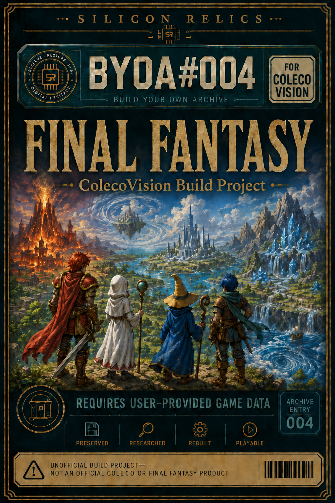

<p align="center"></p>

<p align="center"><sub><i>Final Fantasy is a trademark of Square Enix. NES is a trademark of Nintendo. ColecoVision and every other name mentioned here belong to their respective owners, who have nothing to do with this project. This is an unofficial, non-commercial fan port that contains no game data. Trust is good; not trusting is better: check the hashes, read the code, build it yourself.</i></sub></p>

# coleco-ff

**Final Fantasy (NES, 1987) rewritten in C for the ColecoVision**, with the
Super Game Module and a 512 KB MegaCart. As far as we know, nobody has done
this before.

The NES game is the specification. Disch's commented disassembly is treated as
an executable description of what the game does, and the port reimplements it
in C on a Z80 with 1 KB of stock RAM. It does not translate the 6502 code. The
data is the NES data, extracted from your own ROM at build time. The rules are
the NES rules too, with one set of deliberate exceptions: the known bugs of the
original are fixed, and each fix is documented.

**No game data is included.** To build a ROM you need your own copy of Final
Fantasy (USA). See [Building](#building).

---

## Status

Development snapshot **slice78**. The target is the first arc of the game:
from power-on to the King's bridge and the "FINAL FANTASY" title card that
appears when you cross it.

| Area | State |
|---|---|
| Opening legend, boot menu, class select | ✅ |
| Overworld: discrete tile movement, collision, full-colour tiles, random encounters over the whole map | ✅ |
| Coneria, Coneria Castle 1F/2F, Temple of Fiends: maps, teleports, NPCs, dialogue from the ROM | ✅ |
| Shops: weapon, armor, white and black magic, item, inn, clinic (buying only) | ✅ |
| Battle: physical attacks, enemy AI, magic on both sides, ailments, buffs, EXP, levels, NES formulas | ✅ |
| Menu: items, magic outside battle, equipment, status | ✅ |
| Quest: King, Garland, Princess, Lute, the bridge, the bridge scene | ✅ |
| Treasure chests, DRINK/ITEM in battle, RUN odds, Game Over, name entry, saving | ⏳ see [ROADMAP.md](ROADMAP.md) |
| Battle animations (weapon swings, spell effects) | ⏳ |

**Validated in emulation only.** The regression suite drives MAME
(`-exp sgm`) through 13 scripted runs and checks the result from RAM and VRAM:
560 checks, all passing at slice78. One run, `bridge`, failed once in seven
executions and could not be reproduced; making it closed-loop is on the
[roadmap](ROADMAP.md). CoolCV is used for listening tests. This code has
**never run on real hardware**.

Only part of the quest is validated end to end. The quest run and the bridge
run each start from a build that seeds the party or the bridge flag. A single
unseeded playthrough in one ROM is the next milestone.

## Hardware target

- **ColecoVision + Super Game Module.** FF1 needs about 10 KB of RAM, and the
  stock console has 1 KB. The SGM adds 24 KB, and its AY-3-8910 plays the
  triangle channel next to the SN76489.
- **MegaCart, 512 KB (32 banks of 16 KB).** The last bank is fixed at
  `$8000-$BFFF` and holds the engine and the services. The other banks are
  switched in at `$C000-$FFFF`. Some hold data (maps, graphics, monsters,
  music). Others hold *code* overlays: battle, magic, menu, shops, dialogue,
  intro and the bridge scene, each entered through `svc_run_overlay`. The bank
  map is in one place, at the top of [`tools/build_all.ps1`](tools/build_all.ps1).

## Building

Everything runs on Windows with the built-in **Windows PowerShell 5.1**.

**What you bring**

| | Where it goes |
|---|---|
| **Final Fantasy (USA)** NES ROM, `.nes` with or without the iNES header. The importer checks it: PRG CRC32 `CEBD2A31`. | anywhere; you pass the path |
| **Disch's Final Fantasy disassembly** (the "Final Fantasy Disassembly" folder, usually distributed as `FF1Disassembly-master`). Some extractors parse its `.asm` and `.tbl` files. | `FF1Disassembly-master/Final Fantasy Disassembly/` |
| **z88dk v2.4** for Windows (`z88dk-win32-2.4.zip`) | unzipped to `z88dk/z88dk/` |
| To run it: **MAME** (coleco driver, with your own ColecoVision BIOS in `mame_roms/coleco/`) or **CoolCV** | MAME via `$env:MAME` or `tools/local.ps1` |

**Two commands**

```powershell
.\tools\import_assets.ps1 -Rom 'C:\path\to\Final Fantasy (USA).nes'
.\tools\build_all.ps1
```

`import_assets.ps1` checks the ROM and the disassembly against each other,
then runs every extractor. This generates about 45 headers and blobs: tiles and
colours, maps, monsters, music, text and game tables, all under `src/` and
`build/`, and all ignored by git. `build_all.ps1` compiles the data banks, the
main program and the eight overlays, in the order they depend on each other.
The result is `build/slice78_mc512.rom`.

The build is deterministic. A clean clone built from the same ROM gives the
same bytes every time.

**Running**

```powershell
mame coleco -exp sgm -cart build\slice78_mc512.rom      # -exp sgm is mandatory
.\tools\build_all.ps1 -Run                               # opens CoolCV, if present in CoolCV\
```

**Controls:** joystick and the two fire buttons, as on the NES. The keypad
adds shortcuts: `1`-`4` pick a party member directly, and `*` confirms.

## Testing

```powershell
.\tools\run_regressions.ps1                 # all 13 runs, about 15-20 minutes
.\tools\run_regressions.ps1 -Only quest     # one run
```

Each run compiles its own ROM and drives MAME headless with a Lua script from
`tools/mame_drive_*.lua`. Test builds that seed state use `-Defines` and are
named `*_t.rom`, so they cannot be mistaken for the real ROM.

## Repository layout

| Path | What |
|---|---|
| `src/slice78.c` | The main program: fixed-bank engine, services, overworld, map engine |
| `src/ovl_*.c` | Code overlays, one per switchable bank (battle, magic, menu, shops, talk, intro, bridge) |
| `src/*_bank.c` | Data banks. They only include generated headers and export pointers |
| `src/*.h` | Engine state (party, battle, world, shops) and the service ABI (`svc_api.h`) |
| `crt/` | Startup code for the MegaCart, the data banks and the overlays (derived from z88dk) |
| `tools/import_assets.ps1` | BYOA: every extractor, with the arguments the build needs |
| `tools/extract_*.ps1`, `ff1_extract_song.ps1` | The extractors |
| `tools/build_all.ps1`, `run_regressions.ps1` | Build and test |
| `docs/` | Design notes, **in Italian**: [deviations from the NES](docs/Coleco_improvements.md), [battle engine](docs/battle_engine_design.md), [NES→TMS9918 colours](docs/colors_nes_to_tms.md) |

The project grows in *slices*: each one is a complete copy of the main program
one step further on. Only the current slice is in the repository. Some comments
refer to design notes as `[[name]]`; those notes are the author's private
working log and are not included.

## Credits

In the game, Square's copyright line is kept: on the boot menu, and on the
title card that appears when you cross the bridge. Nintendo's line is removed
from that title card on purpose. Nintendo published the NES version and has
nothing to do with a ColecoVision port, so keeping its name there would credit
it for something it did not do. `tools/extract_bridge_scene.ps1` makes that
choice (`-DropNintendo`, `-DropSquare`).

- **Square**, for the game.
- **Disch**, for the Final Fantasy disassembly. It is the specification this
  port is written against.
- **z88dk**, for the compiler and the ColecoVision startup code that `crt/`
  builds on.
- **AstralEsper**, for the *Game Mechanics Guide* (GameFAQs), which is the
  reference for the battle formulas and for the list of NES bugs.
- Opcode Games, for the Super Game Module and MegaCart designs this port
  depends on.

## Licence

MIT for the original code and tools; see [LICENSE](LICENSE), which also
explains what the licence does not cover.
